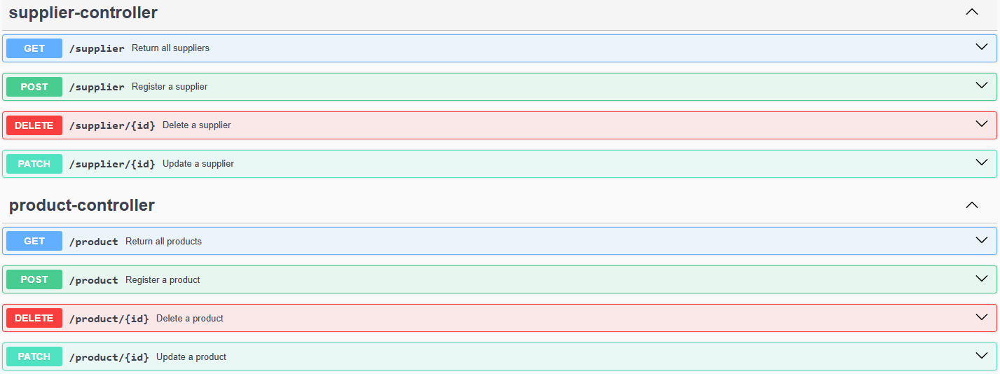

# Sistema CRUD

Projeto de uma REST API usando Spring Framework + h2 como database em memória.  

Feito como objeto de estudo e para aplicar **Boas Práticas** de programação, **Paradigma OO** e **Testes Unitários com Junit + Mockito**.

## Documentação
[Instalação](#instalação)  
[Uso](#uso)  
[Endpoints](#endpoints)

### Instalação:

Clone o projeto:
```git clone http://localhost:8080/swagger-ui/index.html```  

Baixe as dependências com Gradle

---
### Uso:

Rode o projeto com Gradle  

O projeto possui documentação com Swagger, podendo ser acessado em ```http://localhost:8080/swagger-ui/index.html```

#### *Um produto só poderá ser registrado se houver um fornecedor registrado previamente*

---

### Endpoints


